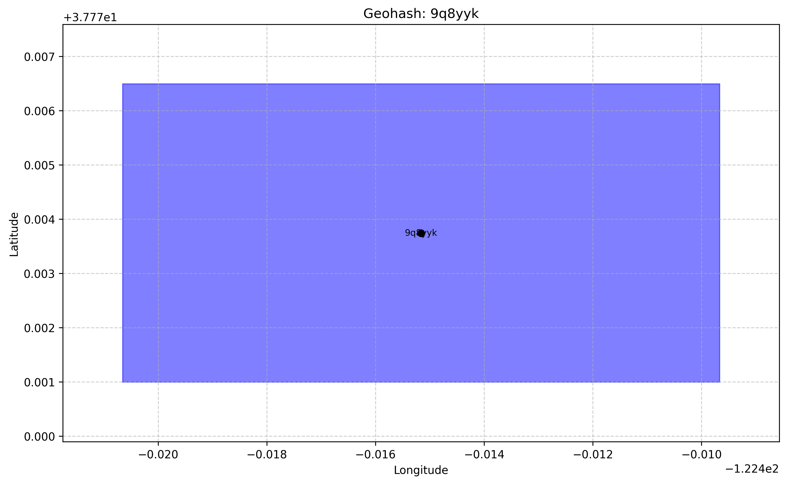

.. pygeohash documentation master file, created by
   sphinx-quickstart on Sat Feb 20 07:44:30 2016.
   You can adapt this file completely to your liking, but it should at least
   contain the root `toctree` directive.

Welcome to PyGeoHash's Documentation!
=====================================

**PyGeoHash** is a simple, lightweight, and dependency-free Python library for working with geohashes.

.. image:: https://badge.fury.io/py/pygeohash.svg
    :target: https://badge.fury.io/py/pygeohash

.. image:: https://img.shields.io/pypi/pyversions/pygeohash.svg
    :target: https://pypi.org/project/pygeohash/

Key Features
-----------

- **Zero Dependencies**: Works with just the Python standard library
- **Simple API**: Clean, intuitive functions that are easy to understand
- **Lightweight**: Minimal overhead for your projects
- **Python 3 Support**: Fully compatible with modern Python
- **Robust Implementation**: Reliable geohash operations
- **Visualization**: Optional visualization capabilities with Matplotlib and Folium

Quick Start
----------

Installation:

.. code-block:: bash

    pip install pygeohash

Basic usage:

.. code-block:: python

    import pygeohash as pgh
    
    # Encode coordinates to geohash
    geohash = pgh.encode(latitude=42.6, longitude=-5.6)
    print(geohash)  # 'ezs42e44yx96'
    
    # Decode geohash to coordinates
    lat, lng = pgh.decode(geohash='ezs42')
    print(lat, lng)  # '42.6', '-5.6'

Visualization:

.. code-block:: bash

    # Install with visualization support
    pip install pygeohash[viz]

.. code-block:: python

    import pygeohash as pgh
    from pygeohash.viz import plot_geohash
    import matplotlib.pyplot as plt
    
    # Plot a geohash
    fig, ax = plot_geohash("9q8yyk", color="red", show_label=True)
    plt.show()

Contents
--------

.. toctree::
   :maxdepth: 2
   
   introduction
   concepts
   usage
   api
   examples

Indices and tables
==================

* :ref:`genindex`
* :ref:`modindex`
* :ref:`search`

