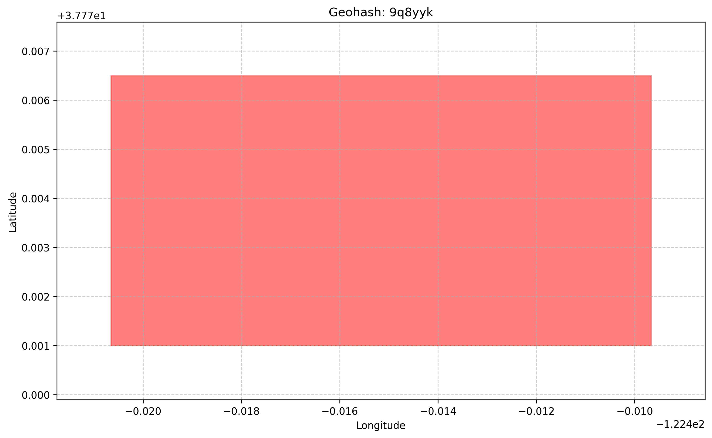
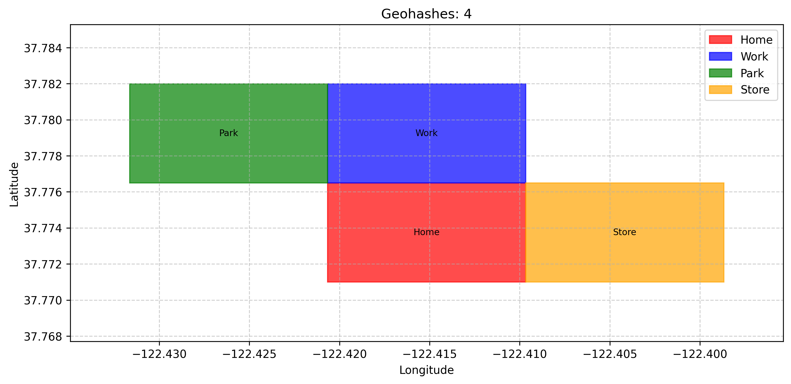

Usage Guide
===========

This guide covers common use cases and patterns for working with the PyGeoHash library.

Installation
------------

PyGeoHash can be installed from PyPI using pip:

.. code-block:: bash

    pip install pygeohash

Basic Operations
----------------

Encoding Coordinates to Geohash
^^^^^^^^^^^^^^^^^^^^^^^^^^^^^^^

To convert latitude and longitude coordinates to a geohash string:

.. code-block:: python

    import pygeohash as pgh
    
    # Default precision (12 characters)
    geohash = pgh.encode(latitude=42.6, longitude=-5.6)
    print(geohash)  # 'ezs42e44yx96'
    
    # Custom precision (5 characters)
    short_geohash = pgh.encode(latitude=42.6, longitude=-5.6, precision=5)
    print(short_geohash)  # 'ezs42'
    
    # Strict encoding (validates input coordinates)
    strict_geohash = pgh.encode_strictly(latitude=42.6, longitude=-5.6, precision=5)
    print(strict_geohash)  # 'ezs42'

Decoding Geohash to Coordinates
^^^^^^^^^^^^^^^^^^^^^^^^^^^^^^^

To convert a geohash string back to latitude and longitude coordinates:

.. code-block:: python

    import pygeohash as pgh
    
    # Basic decoding
    location = pgh.decode(geohash='ezs42')
    print(location.latitude, location.longitude)
    
    # Decoding with error margins
    exact_location = pgh.decode_exactly(geohash='ezs42')
    print(exact_location.latitude, exact_location.longitude)
    print(exact_location.latitude_error, exact_location.longitude_error)  # Error margins

Working with Geohash Precision
------------------------------

The precision of a geohash determines how accurately it represents a location. Each additional character in a geohash increases precision:

.. code-block:: python

    import pygeohash as pgh
    
    # Different precision levels for the same location
    location = (37.371392, -122.046208)  # Google headquarters
    
    for precision in range(1, 13):
        geohash = pgh.encode(location[0], location[1], precision=precision)
        decoded = pgh.decode(geohash)
        print(f"Precision {precision}: {geohash} -> ({decoded.latitude}, {decoded.longitude})")

Calculating Distances
---------------------

To calculate the distance between two geohashes:

.. code-block:: python

    import pygeohash as pgh
    
    # Approximate distance based on matching characters
    approx_distance = pgh.geohash_approximate_distance(
        geohash_1='bcd3u', 
        geohash_2='bc83n'
    )
    print(f"Approximate distance: {approx_distance} meters")
    
    # More accurate distance using Haversine formula
    haversine_distance = pgh.geohash_haversine_distance(
        geohash_1='bcd3u', 
        geohash_2='bc83n'
    )
    print(f"Haversine distance: {haversine_distance} meters")

Finding Adjacent Geohashes
--------------------------

To find geohashes adjacent to a given geohash:

.. code-block:: python

    import pygeohash as pgh
    
    # Get adjacent geohash in a specific direction
    # Directions: 'top', 'right', 'bottom', 'left'
    adjacent_right = pgh.get_adjacent(geohash='kd3ybyu', direction='right')
    print(f"Right: {adjacent_right}")
    
    # Get adjacent geohashes in all four directions
    adjacent_top = pgh.get_adjacent(geohash='kd3ybyu', direction='top')
    adjacent_right = pgh.get_adjacent(geohash='kd3ybyu', direction='right')
    adjacent_bottom = pgh.get_adjacent(geohash='kd3ybyu', direction='bottom')
    adjacent_left = pgh.get_adjacent(geohash='kd3ybyu', direction='left')
    
    print(f"Top: {adjacent_top}")
    print(f"Right: {adjacent_right}")
    print(f"Bottom: {adjacent_bottom}")
    print(f"Left: {adjacent_left}")

Bounding Box Operations
-----------------------

PyGeoHash provides functions for working with geospatial bounding boxes:

.. code-block:: python

    import pygeohash as pgh
    
    # Get the bounding box for a geohash
    geohash = "u4pruyd"
    bbox = pgh.get_bounding_box(geohash)
    
    print(f"Bounding box for {geohash}:")
    print(f"  Min latitude: {bbox.min_lat}")
    print(f"  Min longitude: {bbox.min_lon}")
    print(f"  Max latitude: {bbox.max_lat}")
    print(f"  Max longitude: {bbox.max_lon}")

Checking if a Point is Within a Box
^^^^^^^^^^^^^^^^^^^^^^^^^^^^^^^^^^^

You can check if a point is within a bounding box:

.. code-block:: python

    import pygeohash as pgh
    
    # Define a bounding box
    bbox = pgh.BoundingBox(min_lat=40.0, min_lon=-74.0, max_lat=41.0, max_lon=-73.0)
    
    # Check if a point is within the box
    point_lat, point_lon = 40.5, -73.5
    is_in_box = pgh.is_point_in_box(point_lat, point_lon, bbox)
    print(f"Point ({point_lat}, {point_lon}) is {'inside' if is_in_box else 'outside'} the box")
    
    # Check if a point is within a geohash's bounding box
    geohash = "dr5r"  # New York area
    is_in_geohash = pgh.is_point_in_geohash(point_lat, point_lon, geohash)
    print(f"Point ({point_lat}, {point_lon}) is {'inside' if is_in_geohash else 'outside'} the geohash {geohash}")

Checking if Bounding Boxes Intersect
^^^^^^^^^^^^^^^^^^^^^^^^^^^^^^^^^^^^

You can check if two bounding boxes intersect:

.. code-block:: python

    import pygeohash as pgh
    
    # Define two bounding boxes
    box1 = pgh.BoundingBox(min_lat=40.0, min_lon=-74.0, max_lat=41.0, max_lon=-73.0)
    box2 = pgh.BoundingBox(min_lat=40.5, min_lon=-73.5, max_lat=41.5, max_lon=-72.5)
    
    # Check if they intersect
    do_intersect = pgh.do_boxes_intersect(box1, box2)
    print(f"Boxes {'intersect' if do_intersect else 'do not intersect'}")

Finding Geohashes in a Bounding Box
^^^^^^^^^^^^^^^^^^^^^^^^^^^^^^^^^^^

You can find all geohashes that intersect with a bounding box:

.. code-block:: python

    import pygeohash as pgh
    
    # Define a bounding box
    bbox = pgh.BoundingBox(min_lat=40.0, min_lon=-74.0, max_lat=40.1, max_lon=-73.9)
    
    # Find geohashes that intersect with the box
    geohashes = pgh.geohashes_in_box(bbox, precision=5)
    print(f"Found {len(geohashes)} geohashes at precision 5")
    print(geohashes)
    
    # Try with a different precision
    geohashes_p6 = pgh.geohashes_in_box(bbox, precision=6)
    print(f"Found {len(geohashes_p6)} geohashes at precision 6")

Practical Example: Geospatial Querying
^^^^^^^^^^^^^^^^^^^^^^^^^^^^^^^^^^^^^^

Using bounding boxes for efficient geospatial querying:

.. code-block:: python

    import pygeohash as pgh
    
    # Sample database of locations with their coordinates
    locations = [
        {"id": 1, "name": "Central Park", "lat": 40.785091, "lon": -73.968285},
        {"id": 2, "name": "Empire State Building", "lat": 40.748817, "lon": -73.985428},
        {"id": 3, "name": "Statue of Liberty", "lat": 40.689247, "lon": -74.044502},
        {"id": 4, "name": "Times Square", "lat": 40.758896, "lon": -73.985130},
        {"id": 5, "name": "Brooklyn Bridge", "lat": 40.706086, "lon": -73.996864},
    ]
    
    # Define a search area (bounding box)
    search_area = pgh.BoundingBox(
        min_lat=40.7, min_lon=-74.0, 
        max_lat=40.8, max_lon=-73.9
    )
    
    # Find locations within the search area
    results = []
    for location in locations:
        if pgh.is_point_in_box(location["lat"], location["lon"], search_area):
            results.append(location)
    
    print(f"Found {len(results)} locations within the search area:")
    for location in results:
        print(f"  - {location['name']}")
    
    # Alternative approach using geohashes
    # First, find all geohashes in the search area at precision 5
    geohashes_in_area = pgh.geohashes_in_box(search_area, precision=5)
    
    # Pre-compute geohashes for all locations
    for location in locations:
        location["geohash"] = pgh.encode(location["lat"], location["lon"], precision=5)
    
    # Find locations with matching geohashes
    geohash_results = [
        location for location in locations 
        if location["geohash"] in geohashes_in_area
    ]
    
    print(f"Found {len(geohash_results)} locations using geohash matching:")
    for location in geohash_results:
        print(f"  - {location['name']} (geohash: {location['geohash']})")

Statistical Functions
---------------------

PyGeoHash provides several statistical functions for working with groups of geohashes:

.. code-block:: python

    import pygeohash as pgh
    
    # Sample geohashes
    geohashes = ['ezs42', 'ezs41', 'ezs43', 'ezs40']
    
    # Find the mean position
    mean_position = pgh.mean(geohashes)
    print(f"Mean position: {mean_position}")
    
    # Find cardinal extremes
    north = pgh.northern(geohashes)
    south = pgh.southern(geohashes)
    east = pgh.eastern(geohashes)
    west = pgh.western(geohashes)
    
    print(f"Northernmost: {north}")
    print(f"Southernmost: {south}")
    print(f"Easternmost: {east}")
    print(f"Westernmost: {west}")
    
    # Calculate statistical measures
    variance = pgh.variance(geohashes)
    std_dev = pgh.std(geohashes)
    
    print(f"Variance: {variance} meters²")
    print(f"Standard deviation: {std_dev} meters")

Practical Examples
------------------

Location-Based Search
^^^^^^^^^^^^^^^^^^^^^

Using geohashes for a simple location-based search:

.. code-block:: python

    import pygeohash as pgh
    
    # Define a database of points of interest with their geohashes
    pois = [
        {"name": "Eiffel Tower", "geohash": "u09tvw0f"},
        {"name": "Statue of Liberty", "geohash": "dr5regw3"},
        {"name": "Sydney Opera House", "geohash": "r3gx2u9b"},
        {"name": "Taj Mahal", "geohash": "ttmgrbh1"},
        {"name": "Great Wall of China", "geohash": "wx4g09c6"},
    ]
    
    # User's current location
    user_lat, user_lng = 48.8584, 2.2945  # Paris
    user_geohash = pgh.encode(user_lat, user_lng, precision=5)
    
    # Find nearby POIs (simplified approach)
    nearby_pois = []
    for poi in pois:
        # Compare the first 3 characters (city-level precision)
        if poi["geohash"][:3] == user_geohash[:3]:
            nearby_pois.append(poi)
    
    print(f"Nearby POIs: {nearby_pois}")
    
    # For more accurate results, calculate actual distances
    for poi in pois:
        location = pgh.decode(poi["geohash"])
        distance = pgh.geohash_haversine_distance(
            user_geohash,
            poi["geohash"]
        )
        poi["distance"] = distance
    
    # Sort by distance
    sorted_pois = sorted(pois, key=lambda x: x["distance"])
    print(f"Sorted POIs by distance: {sorted_pois}")

Geofencing
^^^^^^^^^^

Using geohashes for simple geofencing:

.. code-block:: python

    import pygeohash as pgh
    
    # Define a geofence as a set of geohash prefixes
    geofence = {"u09t", "u09s", "u09w"}  # Area around Paris
    
    # Check if a location is within the geofence
    def is_in_geofence(lat, lng, geofence_prefixes, prefix_length=4):
        location_geohash = pgh.encode(lat, lng, precision=prefix_length)
        location_prefix = location_geohash[:4]
        return location_prefix in geofence_prefixes
    
    # Test locations
    test_locations = [
        {"name": "Eiffel Tower", "lat": 48.8584, "lng": 2.2945},
        {"name": "Notre-Dame", "lat": 48.8530, "lng": 2.3499},
        {"name": "London Eye", "lat": 51.5033, "lng": -0.1195},
    ]
    
    for location in test_locations:
        in_geofence = is_in_geofence(location["lat"], location["lng"], geofence)
        print(f"{location['name']} is {'inside' if in_geofence else 'outside'} the geofence")

Visualization
-------------

PyGeoHash provides visualization capabilities through the optional ``viz`` module. To use these functions, you need to install the visualization dependencies:

.. code-block:: bash

    pip install pygeohash[viz]

Plotting a Single Geohash
^^^^^^^^^^^^^^^^^^^^^^^^^

.. code-block:: python

    import pygeohash as pgh
    from pygeohash.viz import plot_geohash
    import matplotlib.pyplot as plt
    
    # Encode a location to a geohash
    geohash = pgh.encode(37.7749, -122.4194, precision=6)  # San Francisco
    
    # Plot the geohash
    fig, ax = plot_geohash(geohash, color="red", alpha=0.5)
    plt.title(f"Geohash: {geohash}")
    plt.show()

Plotting Multiple Geohashes
^^^^^^^^^^^^^^^^^^^^^^^^^^^

.. code-block:: python

    import pygeohash as pgh
    from pygeohash.viz import plot_geohashes
    import matplotlib.pyplot as plt
    
    # Define some locations
    locations = {
        "San Francisco": (37.7749, -122.4194),
        "Oakland": (37.8044, -122.2711),
        "Berkeley": (37.8715, -122.2730),
        "San Jose": (37.3382, -121.8863)
    }
    
    # Encode each location to a geohash
    geohashes = [pgh.encode(lat, lng, precision=6) for name, (lat, lng) in locations.items()]
    
    # Plot the geohashes with labels
    fig, ax = plot_geohashes(
        geohashes,
        labels=list(locations.keys()),
        show_labels=True,
        colors=["red", "blue", "green", "orange"]
    )
    plt.title("Bay Area Locations")
    plt.show()

Creating Interactive Maps
^^^^^^^^^^^^^^^^^^^^^^^^^

PyGeoHash integrates with Folium to create interactive maps:

.. code-block:: python

    import pygeohash as pgh
    from pygeohash.viz import folium_map
    
    # Create a map centered on a location
    m = folium_map(center=(37.7749, -122.4194), zoom_start=12)
    
    # Add geohashes to the map
    geohash = pgh.encode(37.7749, -122.4194, precision=6)
    m.add_geohash(geohash, color="red", popup="San Francisco")
    
    # Add a grid of geohashes at precision 5
    m.add_geohash_grid(precision=5, fill_opacity=0.2)
    
    # Save the map to an HTML file
    m.save("map.html")

For more detailed examples of visualization, see the :doc:`examples` section.

Performance Considerations
--------------------------

- Geohash operations are very fast due to the high-performance C extension implementation
- When working with millions of geohashes, consider using a database with geospatial capabilities
- For high-precision applications, be aware of the limitations of geohashes near poles and the 180° meridian
- Visualization functions may be slower for large numbers of geohashes; consider limiting the number of geohashes displayed or using a lower precision

For more detailed examples of visualization, see the :doc:`examples` section.

Performance Considerations
--------------------------

- Geohash operations are very fast due to the high-performance C extension implementation
- When working with millions of geohashes, consider using a database with geospatial capabilities
- For high-precision applications, be aware of the limitations of geohashes near poles and the 180° meridian
- Visualization functions may be slower for large numbers of geohashes; consider limiting the number of geohashes displayed or using a lower precision 
